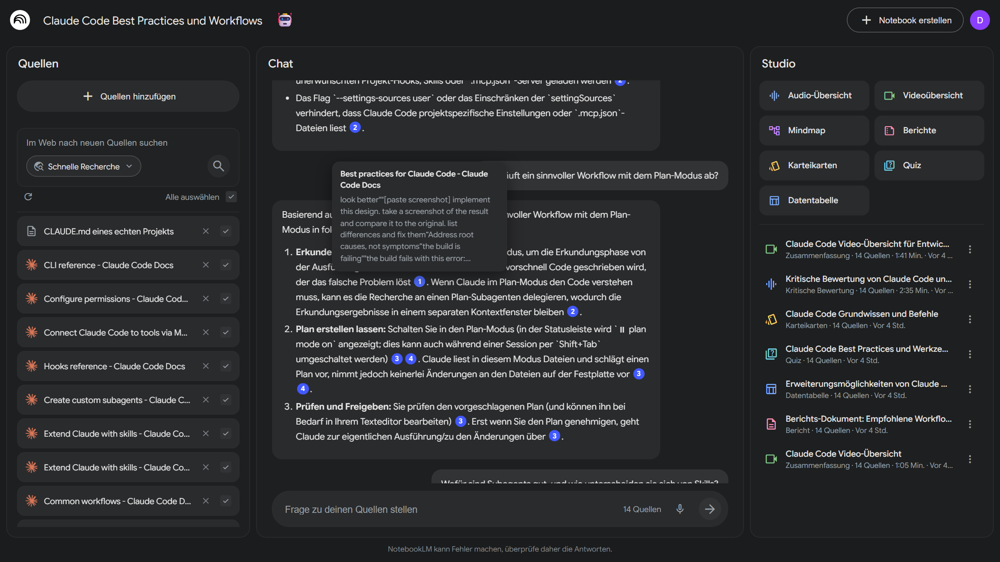
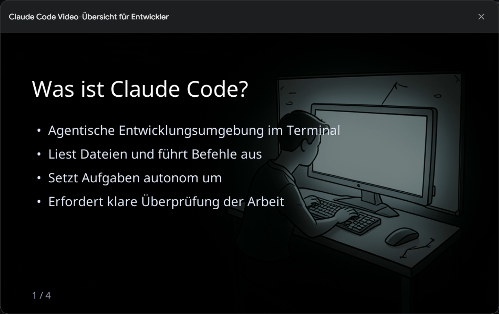
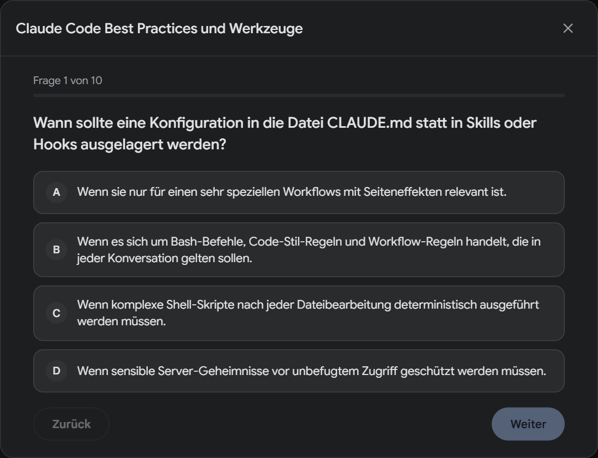

# NotebookLM-Klon

Ein KI-Recherche-Assistent nach dem Vorbild von Google NotebookLM. Man lädt eigene Quellen hoch (PDFs, Webseiten oder Texte) und stellt Fragen dazu. Die KI antwortet ausschließlich auf Basis dieser Quellen und belegt jede Aussage mit einem Verweis auf die passende Textstelle. Aus denselben Quellen entstehen per Klick Berichte, Lernkarten, Quizze sowie vertonte Audio- und Video-Übersichten.

**[Live-Demo öffnen](https://notebooklm.fancy-cherry-09d8.workers.dev)**: „Demo-Zugang erstellen“ legt per Klick ein eigenes Konto mit fertigen Beispiel-Notebooks an, ganz ohne Registrierung.

[](https://github.com/nickoertel2000/notebooklm/actions/workflows/ci.yml)



## Funktionen

- **RAG-Chat mit Zitaten:** Antworten stützen sich nur auf die eigenen Quellen. Jede Aussage trägt einen Verweis, der beim Überfahren die belegende Textstelle zeigt. Die Antwort wird gestreamt und lässt sich abbrechen.
- **Quellen:** PDF-Upload, Webseiten (Haupttext per Readability), eingefügter Text und eine Websuche, die passende Quellen vorschlägt.
- **Studio:** Berichte (Briefing, Lernplan, Blogpost, eigene Vorgabe), Karteikarten, Quiz, Datentabelle und Mindmap.
- **Audio-Übersicht:** ein Podcast-Dialog mit zwei Stimmen, in vier Formaten.
- **Video-Übersicht:** eine vertonte Slideshow mit KI-generierten Folienbildern, gerendert mit ffmpeg.
- **Komfort:** automatischer Notebook-Titel mit passendem Emoji, Spracheingabe, Demo-Konten mit Beispielinhalten.

<table>
  <tr>
    <td></td>
    <td></td>
  </tr>
</table>

## Architektur

```
Browser ──▶ Worker „notebooklm“ (Next.js App Router auf vinext)
               │  Hyperdrive ──▶ Neon Postgres + pgvector
               │  R2 ──▶ Uploads, Audio, Video (Range-Requests)
               ▼
            Worker „notebooklm-jobs“: Cloudflare Workflows
               │  Import · Bericht · Audio · Video
               ▼
            Container „video-renderer“ (Node + ffmpeg)
```

- **Die App rechnet nie lange selbst.** Import, Embeddings und Studio-Inhalte laufen als Workflows mit einzeln wiederholbaren Schritten. Die Route legt eine Zeile mit `processing` an, startet die Instanz und antwortet mit `202`, das Frontend pollt den Status. Nur der Chat läuft synchron (gestreamt).
- **Idempotente Schritte:** Ein Rate-Limit bei Folie 3 wiederholt nur Folie 3. Embeddings werden nur für Chunks ohne Vektor nachgetragen, Binärdaten liegen in R2 statt im Workflow-State.
- **Ein Datenmodell:** Postgres mit `pgvector` statt einer separaten Vektor-Datenbank. Alle Inhalte hängen per Cascade am Notebook und am Nutzer ([`db/schema.ts`](db/schema.ts)).

Einstieg in den Code: [`chat/route.ts`](app/api/notebooks/%5BnotebookId%5D/chat/route.ts) (RAG und Streaming), [`workflows/video.ts`](workers/jobs/src/workflows/video.ts) (mehrstufiger Job), [`lib/quota.ts`](lib/quota.ts) (Kontingente), [`e2e/authz.spec.ts`](e2e/authz.spec.ts) (Mandantentrennung).

## Technische Entscheidungen

| Entscheidung                                        | Begründung                                                                                                                                                                                                                                                |
| --------------------------------------------------- | --------------------------------------------------------------------------------------------------------------------------------------------------------------------------------------------------------------------------------------------------------- |
| Cloudflare Workflows für alles Langlaufende         | LLM-Synthese, TTS und Rendern dauern Minuten und hängen an Rate-Limits. Workflows geben dauerhafte Schritte mit Backoff und überleben Neustarts, ohne eigene Queue-Infrastruktur.                                                                         |
| Exakte Vektorsuche pro Notebook, kein HNSW-Index    | pgvector filtert bei HNSW erst nach der Kandidatensuche über alle Notebooks. Weil Demo-Konten identische Embeddings teilen, kann das eigene Notebook dabei leer ausgehen. Pro Notebook sind es wenige tausend Chunks, die exakte Suche ist schnell genug. |
| Gemini im Gratis-Tarif, mit Modellketten            | Ein Key deckt Text, Embeddings und Sprache ab. Jedes Modell hat ein eigenes Tageskontingent, deshalb weicht jede Anfrage bei `429` auf das nächste Modell aus. Im Chat passiert das nur vor dem ersten Token, sonst käme Text doppelt.                    |
| Kontingente pro Nutzer                              | Alle Besucher teilen sich die Gratis-Kontingente. Rate-Limits pro Minute (Cloudflare), Tageslimits pro Konto und ein Tagesbudget für die ganze Demo (Postgres, race-frei per Advisory Lock) verhindern, dass ein Skript die Demo für alle lahmlegt.       |
| Nummerierte Quellenverweise statt nativer Citations | Gemini kennt keine Zitate für eigene Dokumente. Die Chunks gehen nummeriert in den Prompt, der Server ordnet die `[n]`-Verweise zu (getestet in [`lib/citations.test.ts`](lib/citations.test.ts)).                                                        |
| vinext statt OpenNext                               | Die Next.js-API läuft direkt auf Vite und nativ in workerd. Bindings kommen per `import { env } from "cloudflare:workers"`, ohne Adapter-Schicht.                                                                                                         |
| R2 nur über Bindings                                | Downloads laufen über authentifizierte Routen mit Ownership-Check. Es gibt keine S3-Credentials, keine presigned URLs und kein Bucket-CORS.                                                                                                               |
| Video als vertonte Slideshow                        | Wie beim Original. Folientext rendert ffmpeg per `drawtext` gestochen scharf, weil Bildmodelle bei Text unzuverlässig sind. Bilder kommen von FLUX.2 über Workers AI, begrenzt auf das tägliche Gratis-Kontingent.                                        |
| Demo-Konto pro Besucher                             | Keine Registrierung und kein Google-Konto nötig. Die Beispiel-Notebooks werden per `INSERT … SELECT` in einer Transaktion kopiert, ohne KI-Aufrufe. Ein Cron löscht Konten nach 7 Tagen Inaktivität.                                                      |

## Sicherheit und Qualität

- **Mandantentrennung:** Jede Route prüft Session und Notebook-Besitz (`authorizeNotebook`). Kind-Datensätze werden zusätzlich über die Notebook-ID gefiltert. Ein E2E-Test ruft jede Notebook-Route als fremder Nutzer auf, erwartet `404` und prüft in der Datenbank, dass nichts verändert wurde. Ein zweiter Test schlägt fehl, sobald eine neue Route in dieser Liste fehlt.
- **Missbrauchsschutz:** Cloudflare Turnstile vor Registrierung und Demo-Zugang, Rate-Limits pro Nutzer und pro IP, Tageslimits pro Konto und für die ganze Demo, Längenlimits für alle Eingaben.
- **URL-Import:** nur öffentliche http(s)-Adressen, jede Weiterleitung einzeln geprüft, Timeout und Größenlimit.
- **Header:** CSP (`frame-ancestors`, `object-src`, `base-uri`), HSTS, `nosniff`, Referrer- und Permissions-Policy.
- **Secrets:** aus 1Password per `op inject`, nie im Repo. Fehlermeldungen an den Client enthalten keine Interna.
- **Tests:** Vitest für reine Logik (Chunking, Zitat-Zuordnung, Parser für KI-Ausgaben, WAV, Modellketten, Validierung). Playwright für Login, Bot-Schutz, Demo, Notebook-Anlage, Mandantentrennung und Kontingente, gegen einen frischen Postgres-Container und ohne KI-Aufrufe.
- **Deploy-Gate:** Lint, Typecheck und Tests laufen vor jedem Deploy (Workers Builds). Schlägt etwas fehl, bleibt die alte Version live.

## Arbeitsweise mit Claude Code

Den Großteil des Codes hat Claude Code geschrieben. Architektur, Regeln und Freigaben liegen bei mir. Wie das im Repo aussieht:

- **[`.claude/CLAUDE.md`](.claude/CLAUDE.md):** Projektkontext und harte Regeln, zum Beispiel keine Secrets lesen, keine Dependencies ohne Rückfrage, jeder Datenzugriff über die Ownership-Kette und Schema-Änderungen erst nach meiner Freigabe des generierten SQL.
- **[`.claude/rules/`](.claude/rules):** Konventionen pro Bereich (API, Workflows, Datenbank, Storage, Auth, UI, Tests). Sie laden nur, wenn passende Dateien bearbeitet werden. Neue Fallstricke landen dort, nicht in Kommentaren.
- **[`.claude/hooks/`](.claude/hooks) und [`settings.json`](.claude/settings.json):** Ein Hook blockiert vor jedem Tool-Aufruf jeden Zugriff auf Dateien mit Secrets, auch über Umwege wie `grep` oder `cp`. Nach jeder Änderung formatiert Prettier die Datei, ein Check findet `ae`/`oe`/`ue` statt Umlauten in Kommentaren. Migrationen und DB-Zugriffe brauchen meine Bestätigung.
- **[`.claude/agents/reviewer.md`](.claude/agents/reviewer.md):** ein Review-Agent mit der Checkliste dieses Projekts (Ownership, Kontingente, Validierung, Secrets, Tests, Regeln).
- **[`.claude/commands/`](.claude/commands):** `/pruefen` führt Lint, Typecheck, Unit- und E2E-Tests und das Review aus, `/pr` reicht Änderungen als Pull Request mit Beschreibung ein.
- **Review in jedem PR:** [`claude-review.yml`](.github/workflows/claude-review.yml) prüft jeden Pull Request mit denselben Regeln und kommentiert direkt im Code. Über die Befunde entscheide ich.
- **Regeln bleiben aktuell:** `pnpm check:rules` schlägt in der CI fehl, wenn eine Regel auf eine Datei verweist, die es nicht mehr gibt.

## Betrieb und Kosten

Die Demo soll dauerhaft öffentlich laufen, fast ohne laufende Kosten. Cloudflare läuft im Workers-Paid-Plan (5 $ pro Monat, nötig für Containers). Gemini, Tavily (Websuche), Workers AI und Neon laufen im Gratis-Tarif.

Ist ein Kontingent aufgebraucht, fällt nur die betroffene Funktion aus, nie die ganze App. Ohne Folienbild-Kontingent bekommen Videos einfarbige Hintergründe, bei erschöpftem Modellkontingent springt die nächste Stufe der Modellkette ein.

Mit Budget würde ich Claude (native Citations, bessere Synthese), Voyage-Embeddings und eine eigene Dev-Datenbank als Neon-Branch einsetzen. Die Modelle sind über Worker-Variablen austauschbar.

---

Ein Nachbau zu Demonstrationszwecken, kein Google-Produkt. NotebookLM ist eine Marke der Google LLC.
